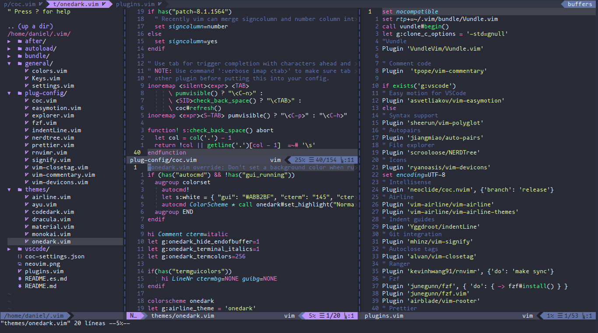

***Language***
- [🇪🇸 Español](./README.es.md)
- 🇺🇸 English

To use this config, first download some dependencies:

1.  Vim-plug
`git clone https://github.com/VundleVim/Vundle.vim.git ~/.vim/bundle/Vundle.vim
`

# Some runtimes are needed, install only those you don't have
sudo pacman -S nodejs npm python python-pip ruby rubygems

# Download neovim packages
pip install neovim
gem install neovim
sudo npm i -g neovim

# Some other dependencies
sudo pacman -S xsel fzf ripgrep fd the_silver_searcher prettier
yay -S universal-ctags-git

2. Configure Plugins:

   Put this at the top of your `.vimrc` to use Vundle. Remove plugins you don't need, they are for illustration purposes.

   ```vim
   set nocompatible              " be iMproved, required
   filetype off                  " required

   " set the runtime path to include Vundle and initialize
   set rtp+=~/.vim/bundle/Vundle.vim
   call vundle#begin()
   " alternatively, pass a path where Vundle should install plugins
   "call vundle#begin('~/some/path/here')

   " let Vundle manage Vundle, required
   Plugin 'VundleVim/Vundle.vim'

   " Here the plugins that you want to intall
   " Plugin '...'
   call vundle#end()            " required
   filetype plugin indent on    " required
   " To ignore plugin indent changes, instead use:
   "filetype plugin on
   "
   " Brief help
   " :PluginList       - lists configured plugins
   " :PluginInstall    - installs plugins; append `!` to update or just :PluginUpdate
   " :PluginSearch foo - searches for foo; append `!` to refresh local cache
   " :PluginClean      - confirms removal of unused plugins; append `!` to auto-approve removal
   "
   " see :h vundle for more details or wiki for FAQ
   " Put your non-Plugin stuff after this line
   ```

3. Install Plugins:

   Launch `vim` and run `:PluginInstall`

   To install from command line: `vim +PluginInstall +qall`

 These are my Keyboard shortcuts

| Atajo                  | Acción                                  |
| ---------------------- | --------------------------------------- |
| **jk** o **kj**                | Cambiar a modo normal (desde insertar)  |
| **alt + [hjkl]**           | Cambiar split de tamaño                 |
| **control + [hjkl]**       | Navegar splits                          |
| **control + s**            | Guardar                                 |
| **control + q**            | Guardar y salir                         |
| **tab**                    | Siguiente buffer                        |
| **shift + tab**            | Buffer previo                           |
| **control + b**            | Cerrar buffer                           |
| **shift + <** or **>**         | Identar o borrar indentación (visual)   |
| **shift + k** o **j**          | Mover línea seleccionada abajo o arriba |

***Plugins***:

| Atajo         | Acción                                  |
| ------------- | --------------------------------------- |
| **space + f**     | Búsqueda                                |
| **space + /**     | Comentar la línea o bloque seleccionado |
| **space + n**     | NerdTree                                |
| **space + p**     | Formatear documento con prettier        |
| **shift + k**     | Documentación de la función o clase     |
